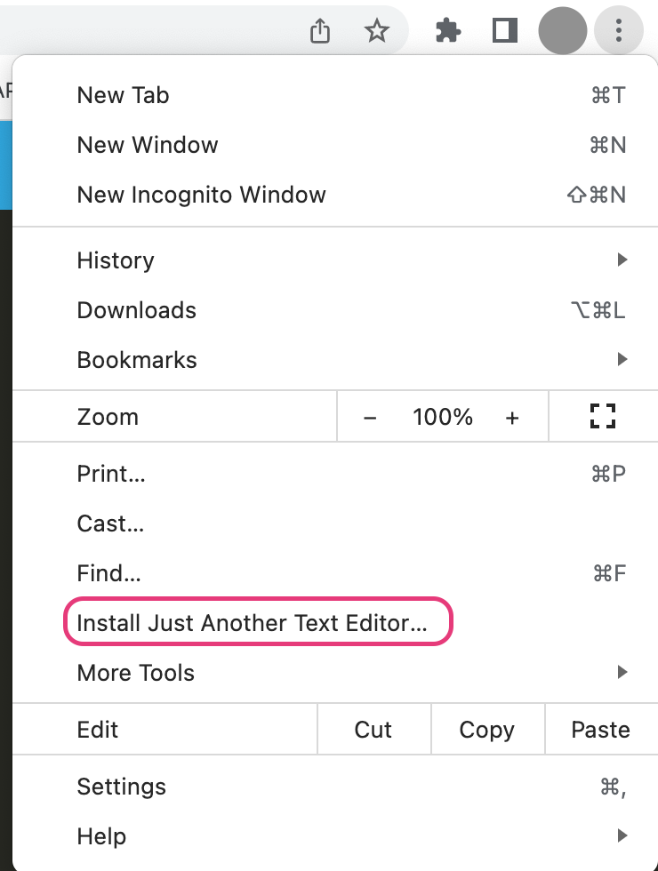

# JATE: Just Another Text Editor

  
  
  Deployed Application: https://cold-tea.herokuapp.com/

  ## Description

  This text editor application was built by implementing methods for getting and storing data using the IndexedDB database. The idb package, a lightweight wrapper around the IndexedDB API, was utilized to facilitate data retrieval and storage. With these features in place, users can create and edit text content, and their changes will be reliably saved using IndexedDB.
 

  ## Table of Contents

  - [Installation](#installation)
  - [Usage](#usage)
  - [License](#license)
  - [Badges](#badges)
  - [Credit](#credit)

  ## Installation

  1. Clone the code from https://github.com/boushka9/immortal-orchid

  2. Type `npm run install` to install dependencies in client and sever

  3. Type `npm run start` to build dist file and then start server 

  

  ## Usage

    Once you have a successful build and the server is running:

    1. Open the application on `http://localhost:3000/` 
    
    2. Click the `Install!` button

    3. Click on the three dots to the right of the extensions icon (on hover, you will see `Customize and control Google Chrome`)

    4. Click `Install Just Another Text Editor...` and confirm installation

    5. Type anything you'd like into your newly installed text editor
  

## Screenshots

  ## License

  This project is licensed under the terms of the MIT license 

  ---

  ## Badges

    
  
  
  

  
  ## Credit
  
  Tutoring session with Tucker Barrett and referencing the Module 19 Mini Challenge

  ## Questions

  If you have any questions regarding this application please contact me through email or GitHub:

  boushka9@gmail.com

  boushka9
